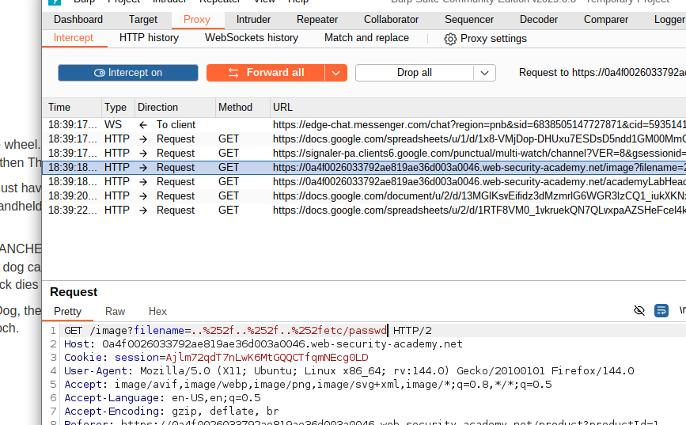
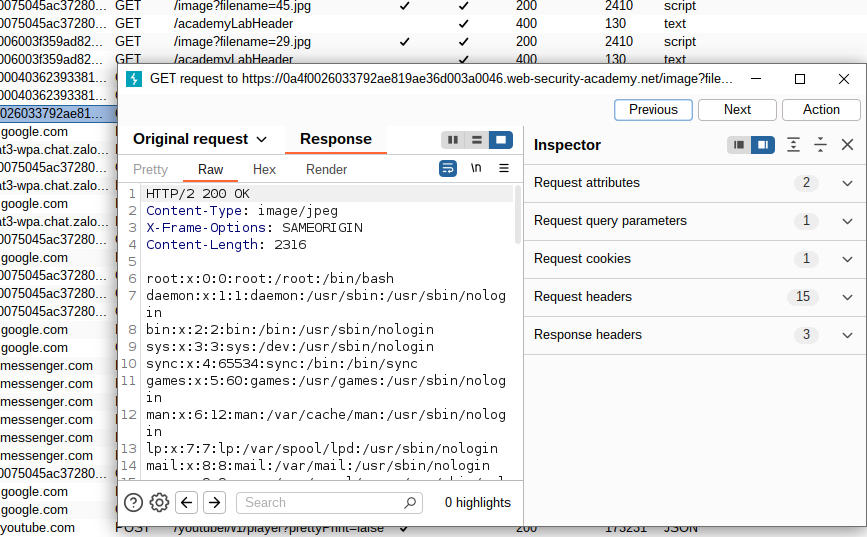
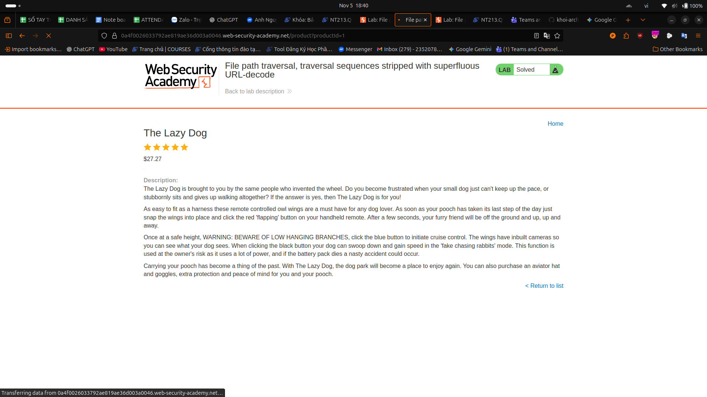

#lab : File path traversal, traversal sequences stripped with superfluous URL-decode

    Use Burp Suite to intercept and modify a request that fetches a product image.

    Modify the filename parameter, giving it the value:
    ..%252f..%252f..%252fetc/passwd
    Observe that the response contains the contents of the /etc/passwd file.

##result

