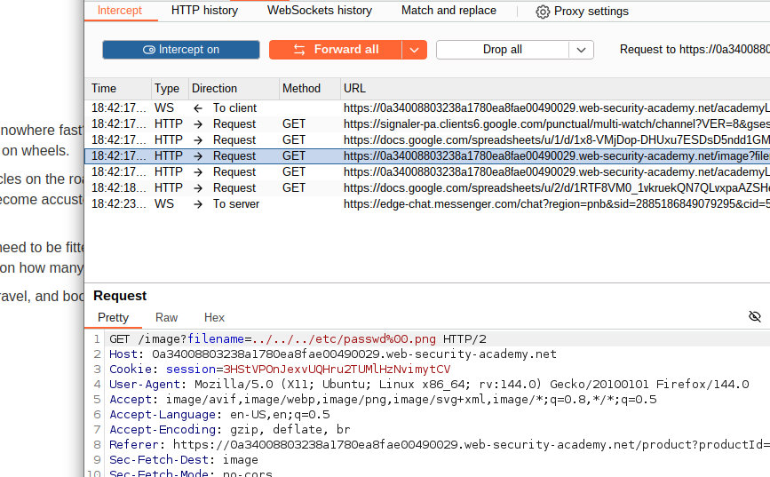
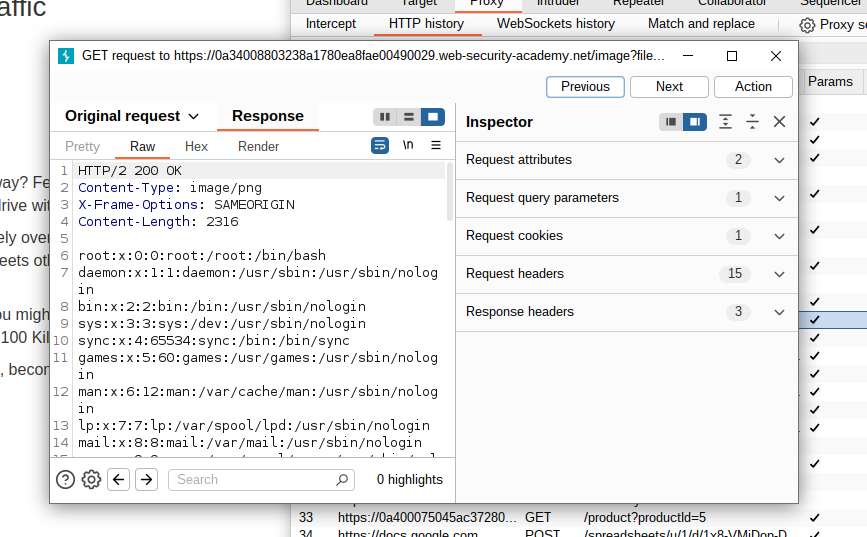
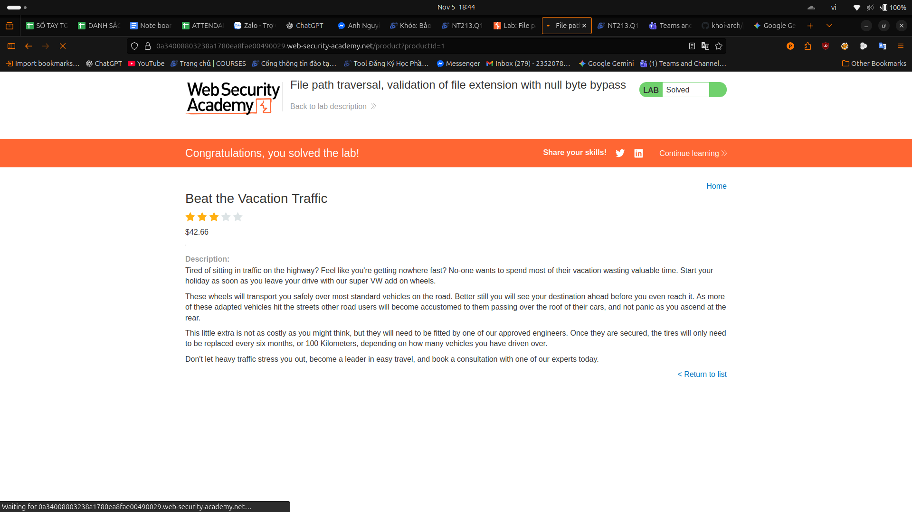

#lab : File path traversal, validation of file extension with null byte bypass

    Use Burp Suite to intercept and modify a request that fetches a product image.

    Modify the filename parameter, giving it the value:
    ../../../etc/passwd%00.png
    Observe that the response contains the contents of the /etc/passwd file.

##result

